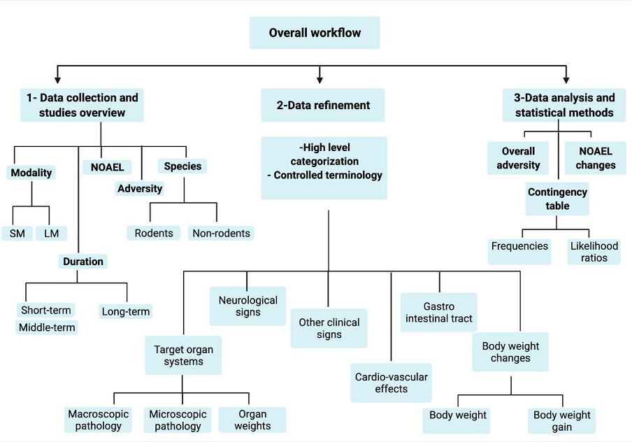

```{r include =FALSE}
knitr::opts_chunk$set( message = FALSE, echo = TRUE, warning = FALSE)
```

This tutorial contains the necessary scripts and data to reproduce the work explained in the paper "CSL-Tox: An open-source analytical framework for the comparison of short-term and long-term toxicity end points and exploring the opportunities for decreasing in-vivo studies conducted for drug development programs."

#### Naga D and Dimitrakopoulou S et al.

#### An overview of the steps performed and implemented in the CSL-Tox workflow.



## 1- Data refinement

-   Uploading necessary libraries and scripts

```{r uploadpack}
library(tidyverse)
library(purrr)
#importing scripts containing functions for reading the data and transform the dataset
source("ReadingData.R")
source("ChangeDataset.R")
options(knitr.kable.NA = '')

```

-   Assigning the file names. The main and pathology datasets are provided in the Data folder: Tables S3 and S4 respectively.

```{r}
MainData_file="Data/S3.txt" 
PathologyData_file="Data/S4.txt"
```

-   Reading the data

```{r}
Data=ReadingData(MainData_file,PathologyData_file)
```

-   Refining the dataset:

(a) Grouping all species into rodents & non rodents
(b) Apply controled terminology
(c) Group findings into the six high level defined categories described in the paper :

| High level categories  |
|------------------------|
| body_weight            |
| body_weight_gain       |
| git_clinical_signs     |
| other_clinical_signs   |
| macroscopic            |
| pathology              |
| organ_weight           |
| cardiovascular_effects |

```{r}
Data=ChangeData(Data)
```

## 2- Data exploration

-   Viewing the data

```{r}

knitr::kable(head(Data$MainData))
knitr::kable(summary(Data))
```

-   Plotting an overview of the data:

```{r}
#importing the script containing the functions
source("DataExploratoryPlots.R")
```

```{r}
Therapeutic_Areas.fn(Data$MainData)
```

```{r}
Different_Species.fn(Data$MainData)
```

```{r}
Dist.St.fn(Data$MainData)
```

```{r}
StudiesPerFindingCat(Data$MainData)
```

```{r}
 Dist.St.fn(Data$MainData)
```

## 3- Data analysis

This section reproduces the main results included in the paper: Overall adversity of molecules, NOAEL changes and likelihood ratios.

-   Calculation of the "Appearance" dataframe : Table containing the drug,modality,species, findings and whether those findings were observed "1" or not observed "0" in short, middle and long studies

```{r}
#importing the script containing the functions
source("Appearance_Functions.R")
Appearance=map_dfr(.x =unique(Data$MainData$identifier),.f = Appear_Drug, Data)
```

```{r}
#Viewing the head of the appearance table 
knitr::kable(head(Appearance))

```

-   Refining the appearance dataframe: Grouping short and middle study together

```{r}
Summarised.Appearance = Cond.Appearance.fn(Appearance)
#head of summarized appearance table
knitr::kable(head(Summarised.Appearance))
```

Note: The finding coloumn in the summarized appearance table contains the high level terms, for more detailed findings the following function can be used:

```{r}
Summarised.Appearance.detailed = Cond.Appearance.ext.fn(Appearance)
knitr::kable(head(Summarised.Appearance.detailed))
```

-   Repeating previous analysis but for adverse events only

```{r}
Adverse.Data=AdverseData.fn(Data)
Adverse.Appearance=map_dfr(.x =unique(Adverse.Data$MainData$identifier),.f = Appear_Drug, Adverse.Data)
Summarised.Adverse.Appearance=Cond.Appearance.fn(Adverse.Appearance)
```

#### (i) Calculation of the overall adversity per modality

-   For SM

```{r}
adversity_sm = Adversity.Summary.fn(Summarised.Adverse.Appearance, type="sm")
knitr::kable(adversity_sm, caption = "Adversity summary for small molecules")
```

-   For LM

```{r}
adversity_lm = Adversity.Summary.fn(Summarised.Adverse.Appearance, type="lm")
knitr::kable(adversity_lm, caption = "Adversity summary for large molecules")
```

#### (ii) Calculation of the NOAEL changes from short to long-term studies

```{r}
#importing the script containing the functions
source("NOAEL_Change.R")
#table with results for sm
knitr::kable(result_sm, caption = "Noael changes for small molecules")
```

```{r}
#table with results for lm
knitr::kable(result_lm,caption = "Noael changes for large molecules")
```

#### (iii) Calculation of the Likelihood ratios

```{r}
#importing the script containing the functions
source("LikelihoodRatio.R")
```

-   Calculate contingency tables and likelihood ratios for all findings

Specify rodent or non-rodent:

```{r}
animal = "rodent"
Likelihood.Ratio=Likelihood.Ratio.fn(Summarised.Appearance %>% filter(species== animal))

```

-   Round values and select only significant likelihood ratios with p-values \< 0.05

```{r}
Likelihood.Ratio[,-1]=round(Likelihood.Ratio[,-1],2)

#Likelihood ratios with p.value<0.05
Likelihood.Ratio.imp=Likelihood.Ratio %>% filter(p_value<=0.05) %>% 
  arrange(desc(LR_pos), desc(iLR_neg)) %>% select(-c(Sensitivity,Specificity))

knitr::kable(Likelihood.Ratio.imp,caption = "Significant Likelihood ratios for rodents for all findings")

```

-   Plot frequency of fp and fn across the findings in rodent and non-rodent

```{r}
Appear_plot(dataf = Likelihood.Ratio.imp ,species = "rodent", legend_pos=c(0.90,0.90))
```

-   Calculate contingency tables and likelihood ratios for adverse findings only (using the adverse appearance table this time)

```{r}
Adverse.Likelihood.Ratio=Likelihood.Ratio.fn(Summarised.Adverse.Appearance %>% filter(species== animal))
```

-   Round values and select only significant likelihood ratios with p-values \< 0.05

```{r}
Adverse.Likelihood.Ratio[,-1]=round(Adverse.Likelihood.Ratio[,-1],2)

#Likelihood ratios with p.value<0.05
Adverse.Likelihood.Ratio.imp=Adverse.Likelihood.Ratio %>% filter(p_value<=0.05) %>% 
arrange(desc(LR_pos), desc(iLR_neg)) %>%  select(-c(Sensitivity,Specificity))

knitr::kable(Adverse.Likelihood.Ratio,caption = "Significant Likelihood ratios for rodents for adverse findings in rodents")

```

-   Plot frequency of fp and fn across the adverse findings

```{r}
Appear_plot(dataf = Adverse.Likelihood.Ratio.imp ,species = "rodent", legend_pos=c(0.90,0.90))
```

The previous steps are repeated to generate the results for the non-rodent species.
