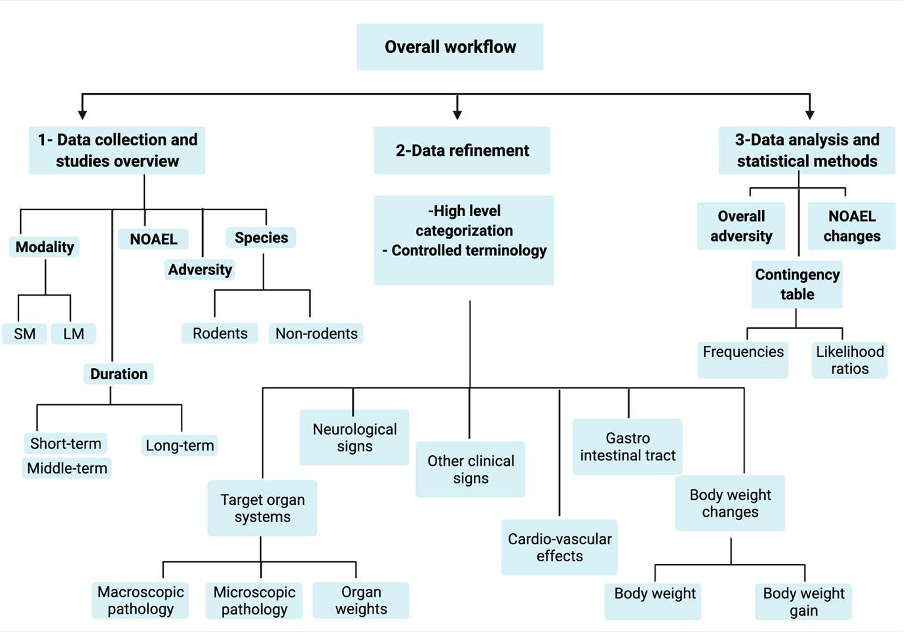
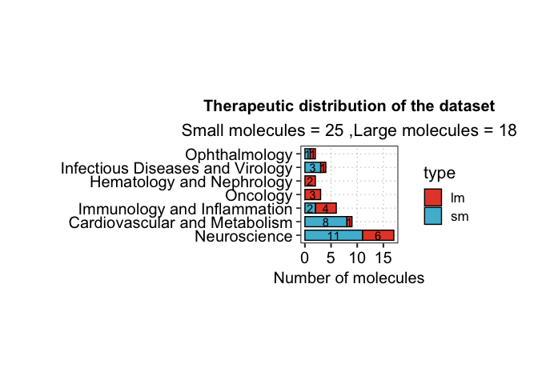
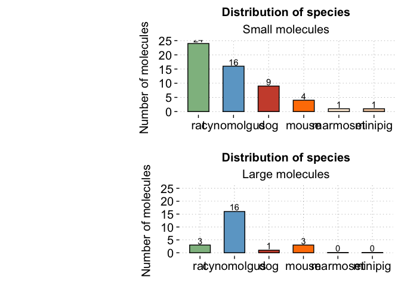
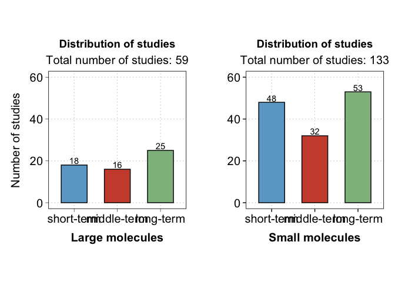
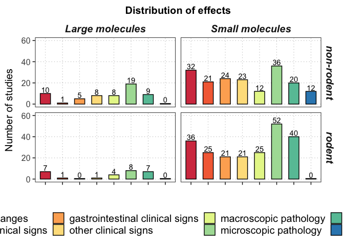
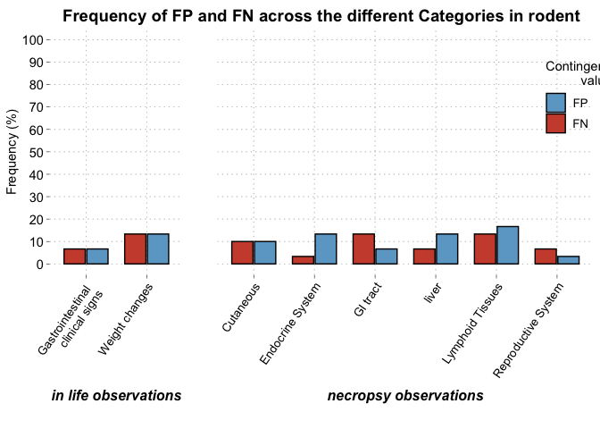
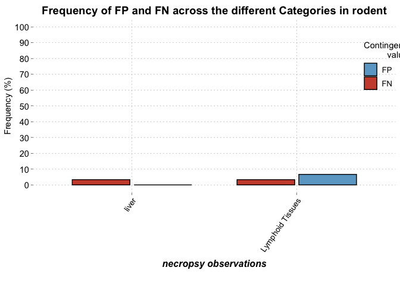

CSL-Tox
================

``` r
knitr::opts_chunk$set( message = FALSE, echo = TRUE, warning = FALSE)
```

This tutorial contains the necessary scripts and data to reproduce the
work explained in the paper “CSL-Tox: An open-source analytical
framework for the comparison of short-term and long-term toxicity end
points and exploring the opportunities for decreasing in-vivo studies
conducted for drug development programs.”

#### Naga D and Dimitrakopoulou S et al.

#### An overview of the steps performed and implemented in the CSL-Tox workflow.



## 1- Data refinement

-   Uploading necessary libraries and scripts

``` r
library(tidyverse)
library(purrr)
source("ReadingData.R")
source("ChangeDataset.R")
options(knitr.kable.NA = '')
```

-   Assigning the file names. The main and pathology datasets are
    provided in the Data folder: Tables S3 and S4 respectively.

``` r
MainData_file="Data/S3.txt" 
PathologyData_file="Data/S4.txt"
```

-   Reading the data

``` r
Data=ReadingData(MainData_file,PathologyData_file)
```

-   Refining the dataset:

1)  Grouping all species into rodents & non rodents
2)  Apply controled terminology
3)  Group findings into the six high level defined categories described
    in the paper :

| High level categories  |
|------------------------|
| body_weight            |
| body_weight_gain       |
| git_clinical_signs     |
| other_clinical_signs   |
| macroscopic            |
| pathology              |
| organ_weight           |
| cardiovascular_effects |

``` r
Data=ChangeData(Data)
```

## 2- Data exploration

-   Viewing the data

``` r
knitr::kable(head(Data$MainData))
```

| study_id | identifier | therapeutic_area              | type | route_of_administration | species    | duration | dose | adj_dose | pre_treatment | dose_interval | dose_lethality | noael | noael_sex | adverse_findings | body_weight | body_weight_gain | death_diagnosis | neurological_clinical_signs | git_clinical_signs | other_clinical_signs | lab_measurements | macroscopic | pathology | organ_weight | cardiovascular_effects | group |
|:---------|:-----------|:------------------------------|:-----|:------------------------|:-----------|---------:|:-----|---------:|:--------------|:--------------|:---------------|:------|:----------|:-----------------|:------------|:-----------------|:----------------|:----------------------------|:-------------------|:---------------------|:-----------------|:------------|:----------|:-------------|:-----------------------|:------|
| Study 1  | Compound 1 | Cardiovascular and Metabolism | sm   | subcutaneous            | non-rodent |       39 | 0    |     0.00 |               | bi weekly     |                | no    |           | no               | no          | no               | no              | no                          | no                 | no                   | no               | no          | no        | no           | no                     | long  |
| Study 1  | Compound 1 | Cardiovascular and Metabolism | sm   | subcutaneous            | non-rodent |       39 | 5    |     0.36 |               | bi weekly     |                | no    |           | no               | no          | no               | no              | no                          | no                 | no                   | no               | no          | no        | no           | no                     | long  |
| Study 1  | Compound 1 | Cardiovascular and Metabolism | sm   | subcutaneous            | non-rodent |       39 | 25   |     1.79 |               | bi weekly     |                | no    |           | no               | no          | no               | no              | no                          | no                 | no                   | no               | no          | no        | no           | no                     | long  |
| Study 1  | Compound 1 | Cardiovascular and Metabolism | sm   | subcutaneous            | non-rodent |       39 | 100  |     7.14 |               | bi weekly     |                | yes   | both      | no               | no          | yes              | no              | no                          | no                 | no                   | no               | no          | no        | no           | no                     | long  |
| Study 2  | Compound 1 | Cardiovascular and Metabolism | sm   | subcutaneous            | rodent     |       26 | 0    |     0.00 |               | bi weekly     |                | no    |           | no               | no          | no               | no              | no                          | no                 | no                   | no               | no          | no        | no           | no                     | long  |
| Study 2  | Compound 1 | Cardiovascular and Metabolism | sm   | subcutaneous            | rodent     |       26 | 2.5  |     0.18 |               | bi weekly     |                | no    |           | no               | yes         | yes              | no              | yes                         | yes                | yes                  | yes-r            | yes         | yes       | no           | no                     | long  |

``` r
knitr::kable(summary(Data))
```

|                                     | Length | Class      | Mode |
|:------------------------------------|:-------|:-----------|:-----|
| MainData                            | 27     | data.frame | list |
| body_weight_Dataset                 | 14     | data.frame | list |
| neurological_clinical_signs_Dataset | 14     | data.frame | list |
| git_clinical_signs_Dataset          | 14     | data.frame | list |
| other_clinical_signs_Dataset        | 14     | data.frame | list |
| macroscopic_Dataset                 | 15     | data.frame | list |
| organ_weight_Dataset                | 15     | data.frame | list |
| cardiovascular_effects_Dataset      | 14     | data.frame | list |
| pathology_Dataset                   | 15     | data.frame | list |

-   Plotting an overview of the data:

``` r
source("DataExploratoryPlots.R")
```

``` r
Therapeutic_Areas.fn(Data$MainData)
```

<!-- -->

``` r
Different_Species.fn(Data$MainData)
```

<!-- -->

``` r
Dist.St.fn(Data$MainData)
```

<!-- -->

``` r
StudiesPerFindingCat(Data$MainData)
```

<!-- -->

``` r
 Dist.St.fn(Data$MainData)
```

<!-- -->

## 3- Data analysis

This section reproduces the main results included in the paper: Overall
adversity of molecules, NOAEL changes and likelihood ratios.

-   Calculation of the “Appearance” dataframe : Table containing the
    drug,modality,species, findings and whether those findings were
    observed “1” or not observed “0” in short, middle and long studies

``` r
#executing the script
source("Appearance_Functions.R")
Appearance=map_dfr(.x =unique(Data$MainData$identifier),.f = Appear_Drug, Data)
```

``` r
#Viewing the head of the appearance table 
knitr::kable(head(Appearance))
```

| drug       | modality | species    | finding                         | short | middle | long |
|:-----------|:---------|:-----------|:--------------------------------|------:|-------:|-----:|
| Compound 1 | sm       | rodent     | Weight changes                  |     1 |      1 |    1 |
| Compound 1 | sm       | non-rodent | Weight changes                  |     1 |      0 |    1 |
| Compound 1 | sm       | rodent     | Neurological clinical signs     |     1 |      0 |    1 |
| Compound 1 | sm       | non-rodent | Neurological clinical signs     |     0 |      0 |    0 |
| Compound 1 | sm       | rodent     | Gastrointestinal clinical signs |     0 |      0 |    1 |
| Compound 1 | sm       | non-rodent | Gastrointestinal clinical signs |     0 |      0 |    0 |

-   Refining the appearance dataframe: Grouping short and middle study
    together

``` r
Summarised.Appearance = Cond.Appearance.fn(Appearance)
#head of summarized appearance table
knitr::kable(head(Summarised.Appearance))
```

| drug       | modality | species    | finding                         | short.cond | middle.cond | long.cond | short_middle.cond |
|:-----------|:---------|:-----------|:--------------------------------|:-----------|:------------|:----------|:------------------|
| Compound 1 | sm       | non-rodent | Cardiovascular System           | FALSE      | FALSE       | FALSE     | FALSE             |
| Compound 1 | sm       | non-rodent | Cutaneous                       | TRUE       | FALSE       | TRUE      | TRUE              |
| Compound 1 | sm       | non-rodent | Endocrine System                | FALSE      | FALSE       | FALSE     | FALSE             |
| Compound 1 | sm       | non-rodent | Exocrine System                 | FALSE      | FALSE       | FALSE     | FALSE             |
| Compound 1 | sm       | non-rodent | Eye/conjuctiva                  | FALSE      | FALSE       | FALSE     | FALSE             |
| Compound 1 | sm       | non-rodent | Gastrointestinal clinical signs | FALSE      | FALSE       | FALSE     | FALSE             |

Note: The finding coloumn in the summarized appearance table contains
the high level terms, for more detailed findings the following function
can be used:

``` r
Summarised.Appearance.detailed = Cond.Appearance.ext.fn(Appearance)
knitr::kable(head(Summarised.Appearance.detailed))
```

| drug       | modality | species    | finding                                      | short.cond | middle.cond | long.cond | short_middle.cond |
|:-----------|:---------|:-----------|:---------------------------------------------|:-----------|:------------|:----------|:------------------|
| Compound 1 | sm       | non-rodent | Cardiovascular System/ microscopic pathology | FALSE      | FALSE       | FALSE     | FALSE             |
| Compound 1 | sm       | non-rodent | Cardiovascular System/macroscopic pathology  | FALSE      | FALSE       | FALSE     | FALSE             |
| Compound 1 | sm       | non-rodent | Cardiovascular System/organ weight change    | FALSE      | FALSE       | FALSE     | FALSE             |
| Compound 1 | sm       | non-rodent | Cutaneous/ microscopic pathology             | TRUE       | FALSE       | TRUE      | TRUE              |
| Compound 1 | sm       | non-rodent | Cutaneous/macroscopic pathology              | TRUE       | FALSE       | TRUE      | TRUE              |
| Compound 1 | sm       | non-rodent | Endocrine System/ microscopic pathology      | FALSE      | FALSE       | FALSE     | FALSE             |

-   Repeating previous analysis but for adverse events only

``` r
Adverse.Data=AdverseData.fn(Data)
Adverse.Appearance=map_dfr(.x =unique(Adverse.Data$MainData$identifier),.f = Appear_Drug, Adverse.Data)
Summarised.Adverse.Appearance=Cond.Appearance.fn(Adverse.Appearance)
```

#### (i) Calculation of the overall adversity per modality

-   For SM

``` r
adversity_sm = Adversity.Summary.fn(Summarised.Adverse.Appearance, type="sm")
knitr::kable(adversity_sm, caption = "Adversity summary for small molecules")
```

| drug        | short_middle | long  |
|:------------|:-------------|:------|
| Compound 1  | FALSE        | FALSE |
| Compound 2  | FALSE        | FALSE |
| Compound 3  | FALSE        | FALSE |
| Compound 4  | FALSE        | FALSE |
| Compound 5  | FALSE        | FALSE |
| Compound 6  | FALSE        | TRUE  |
| Compound 7  | FALSE        | TRUE  |
| Compound 10 | TRUE         | FALSE |
| Compound 11 | TRUE         | FALSE |
| Compound 8  | TRUE         | FALSE |
| Compound 9  | TRUE         | FALSE |
| Compound 12 | TRUE         | TRUE  |
| Compound 13 | TRUE         | TRUE  |
| Compound 14 | TRUE         | TRUE  |
| Compound 15 | TRUE         | TRUE  |
| Compound 16 | TRUE         | TRUE  |
| Compound 17 | TRUE         | TRUE  |
| Compound 18 | TRUE         | TRUE  |
| Compound 19 | TRUE         | TRUE  |
| Compound 20 | TRUE         | TRUE  |
| Compound 21 | TRUE         | TRUE  |
| Compound 22 | TRUE         | TRUE  |
| Compound 23 | TRUE         | TRUE  |
| Compound 24 | TRUE         | TRUE  |
| Compound 25 | TRUE         | TRUE  |

Adversity summary for small molecules

-   For LM

``` r
adversity_lm = Adversity.Summary.fn(Summarised.Adverse.Appearance, type="lm")
knitr::kable(adversity_lm, caption = "Adversity summary for large molecules")
```

| drug       | short_middle | long  |
|:-----------|:-------------|:------|
| Compound a | FALSE        | FALSE |
| Compound b | FALSE        | FALSE |
| Compound c | FALSE        | FALSE |
| Compound d | FALSE        | FALSE |
| Compound e | FALSE        | FALSE |
| Compound f | FALSE        | FALSE |
| Compound g | FALSE        | FALSE |
| Compound h | FALSE        | FALSE |
| Compound i | FALSE        | FALSE |
| Compound j | FALSE        | FALSE |
| Compound k | FALSE        | FALSE |
| Compound l | FALSE        | FALSE |
| Compound m | FALSE        | FALSE |
| Compound n | FALSE        | FALSE |
| Compound o | FALSE        | TRUE  |
| Compound p | TRUE         | TRUE  |
| Compound q | TRUE         | TRUE  |
| Compound r | TRUE         | TRUE  |

Adversity summary for large molecules

#### (ii) Calculation of the NOAEL changes from short to long-term studies

``` r
#importing the NOAEL change script
source("NOAEL_Change.R")
#table with results for sm
knitr::kable(result_sm, caption = "Noael changes for small molecules")
```

| identifier  | noael    | species    |
|:------------|:---------|:-----------|
| Compound 1  | Increase | non-rodent |
| Compound 2  | Same     | non-rodent |
| Compound 3  | Increase | non-rodent |
| Compound 4  | Same     | non-rodent |
| Compound 5  | Decrease | non-rodent |
| Compound 6  | Decrease | non-rodent |
| Compound 8  | Increase | non-rodent |
| Compound 9  | Same     | non-rodent |
| Compound 10 | Same     | non-rodent |
| Compound 11 | Increase | non-rodent |
| Compound 12 | Decrease | non-rodent |
| Compound 13 | Decrease | non-rodent |
| Compound 14 | Decrease | non-rodent |
| Compound 15 | Increase | non-rodent |
| Compound 17 | Same     | non-rodent |
| Compound 18 | Decrease | non-rodent |
| Compound 19 | Same     | non-rodent |
| Compound 20 | Decrease | non-rodent |
| Compound 21 | Increase | non-rodent |
| Compound 22 | Increase | non-rodent |
| Compound 24 | Decrease | non-rodent |
| Compound 25 | Decrease | non-rodent |
| Compound 1  | Same     | rodent     |
| Compound 2  | Same     | rodent     |
| Compound 3  | Same     | rodent     |
| Compound 4  | Decrease | rodent     |
| Compound 5  | Decrease | rodent     |
| Compound 6  | Same     | rodent     |
| Compound 9  | Same     | rodent     |
| Compound 10 | Decrease | rodent     |
| Compound 11 | Increase | rodent     |
| Compound 12 | Same     | rodent     |
| Compound 13 | Same     | rodent     |
| Compound 14 | Decrease | rodent     |
| Compound 15 | Increase | rodent     |
| Compound 16 | Same     | rodent     |
| Compound 17 | Same     | rodent     |
| Compound 18 | Decrease | rodent     |
| Compound 19 | Increase | rodent     |
| Compound 20 | Decrease | rodent     |
| Compound 21 | Same     | rodent     |
| Compound 22 | Decrease | rodent     |
| Compound 23 | Decrease | rodent     |
| Compound 24 | Increase | rodent     |
| Compound 25 | Decrease | rodent     |

Noael changes for small molecules

``` r
#table with results for lm
knitr::kable(result_lm,caption = "Noael changes for large molecules")
```

| identifier | noael    | species    |
|:-----------|:---------|:-----------|
| Compound a | Same     | non-rodent |
| Compound b | Same     | non-rodent |
| Compound c | Increase | non-rodent |
| Compound d | Decrease | non-rodent |
| Compound e | Decrease | non-rodent |
| Compound f | Increase | non-rodent |
| Compound g | Increase | non-rodent |
| Compound h | Increase | non-rodent |
| Compound i | Increase | non-rodent |
| Compound j | Same     | non-rodent |
| Compound k | Increase | non-rodent |
| Compound l | Increase | non-rodent |
| Compound m | Same     | non-rodent |
| Compound n | Same     | non-rodent |
| Compound o | Decrease | non-rodent |
| Compound q | Same     | non-rodent |
| Compound r | Decrease | non-rodent |
| Compound d | Same     | rodent     |
| Compound k | Increase | rodent     |
| Compound m | Same     | rodent     |
| Compound n | Same     | rodent     |
| Compound p | Decrease | rodent     |
| Compound q | Decrease | rodent     |

Noael changes for large molecules

#### (iii) Calculation of the Likelihood ratios

``` r
source("LikelihoodRatio.R")
```

-   Calculate contingency tables and likelihood ratios for all findings

Specify rodent or non-rodent:

``` r
animal = "rodent"
Likelihood.Ratio=Likelihood.Ratio.fn(Summarised.Appearance %>% filter(species== animal))
```

Round values and select only significant likelihood ratios with pvalues
\< 0.05

``` r
Likelihood.Ratio[,-1]=round(Likelihood.Ratio[,-1],2)

#Likelihood ratios with p.value<0.05
Likelihood.Ratio.imp=Likelihood.Ratio %>% filter(p_value<=0.05) %>% 
  arrange(desc(LR_pos), desc(iLR_neg)) %>% select(-c(Sensitivity,Specificity))

knitr::kable(Likelihood.Ratio.imp,caption = "Significant Likelihood ratios for rodents for all findings")
```

| finding                         |  TP |  FP |  FN |  TN | LR_pos | iLR_neg | p_value |
|:--------------------------------|----:|----:|----:|----:|-------:|--------:|--------:|
| Reproductive System             |   4 |   1 |   2 |  23 |  16.00 |    2.87 |    0.00 |
| Gastrointestinal clinical signs |   7 |   2 |   2 |  19 |   8.17 |    4.07 |    0.00 |
| GI tract                        |   5 |   2 |   4 |  19 |   5.83 |    2.04 |    0.01 |
| Cutaneous                       |   5 |   3 |   3 |  19 |   4.58 |    2.30 |    0.02 |
| Endocrine System                |  13 |   4 |   1 |  12 |   3.71 |   10.50 |    0.00 |
| liver                           |  14 |   4 |   2 |  10 |   3.06 |    5.71 |    0.00 |
| Lymphoid Tissues                |   9 |   5 |   4 |  12 |   2.35 |    2.29 |    0.04 |
| Weight changes                  |  14 |   4 |   4 |   8 |   2.33 |    3.00 |    0.02 |

Significant Likelihood ratios for rodents for all findings

Plot frequency of fp and fn across the findings in rodent and non-rodent

``` r
Appear_plot(dataf = Likelihood.Ratio.imp ,species = "rodent", legend_pos=c(0.90,0.90))
```

<!-- -->

-   Calculate contingency tables and likelihood ratios for adverse
    findings only (using the adverse appearance table this time)

``` r
Adverse.Likelihood.Ratio=Likelihood.Ratio.fn(Summarised.Adverse.Appearance %>% filter(species== animal))
```

Round values and select only significant likelihood ratios with pvalues
\< 0.05

``` r
Adverse.Likelihood.Ratio[,-1]=round(Adverse.Likelihood.Ratio[,-1],2)

#Likelihood ratios with p.value<0.05
Adverse.Likelihood.Ratio.imp=Adverse.Likelihood.Ratio %>% filter(p_value<=0.05) %>% 
arrange(desc(LR_pos), desc(iLR_neg)) %>%  select(-c(Sensitivity,Specificity))

knitr::kable(Adverse.Likelihood.Ratio,caption = "Significant Likelihood ratios for rodents for adverse findings in rodents")
```

| finding                         |  TP |  FP |  FN |  TN | Sensitivity | Specificity | LR_pos | iLR_neg | p_value |
|:--------------------------------|----:|----:|----:|----:|------------:|------------:|-------:|--------:|--------:|
| Cardiovascular System           |   0 |   1 |   3 |  26 |        0.00 |        0.96 |   0.00 |    0.96 |    1.00 |
| Cutaneous                       |   0 |   4 |   2 |  24 |        0.00 |        0.86 |   0.00 |    0.86 |    1.00 |
| Endocrine System                |   2 |   4 |   1 |  23 |        0.67 |        0.85 |   4.50 |    2.56 |    0.09 |
| Exocrine System                 |   1 |   1 |   4 |  24 |        0.20 |        0.96 |   5.00 |    1.20 |    0.31 |
| Eye/conjuctiva                  |   0 |   0 |   1 |  29 |        0.00 |        1.00 |        |    1.00 |    1.00 |
| Gastrointestinal clinical signs |   0 |   1 |   0 |  29 |             |        0.97 |        |         |    1.00 |
| GI tract                        |   2 |   3 |   1 |  24 |        0.67 |        0.89 |   6.00 |    2.67 |    0.06 |
| In life cardiovascular effects  |   0 |   0 |   0 |  30 |             |        1.00 |        |         |    1.00 |
| liver                           |   3 |   0 |   1 |  26 |        0.75 |        1.00 |    Inf |    4.00 |    0.00 |
| Lymphoid Tissues                |   2 |   2 |   1 |  25 |        0.67 |        0.93 |   9.00 |    2.78 |    0.04 |
| MuscularSkeletal System         |   0 |   3 |   1 |  26 |        0.00 |        0.90 |   0.00 |    0.90 |    1.00 |
| Nervous System                  |   1 |   0 |   3 |  26 |        0.25 |        1.00 |    Inf |    1.33 |    0.13 |
| Neurological clinical signs     |   2 |   2 |   2 |  24 |        0.50 |        0.92 |   6.50 |    1.85 |    0.07 |
| Other clinical signs            |   1 |   4 |   2 |  23 |        0.33 |        0.85 |   2.25 |    1.28 |    0.43 |
| Reproductive System             |   0 |   2 |   2 |  26 |        0.00 |        0.93 |   0.00 |    0.93 |    1.00 |
| Respiratory System              |   0 |   1 |   1 |  28 |        0.00 |        0.97 |   0.00 |    0.97 |    1.00 |
| Urinary System                  |   0 |   1 |   5 |  24 |        0.00 |        0.96 |   0.00 |    0.96 |    1.00 |
| Weight changes                  |   0 |   6 |   3 |  21 |        0.00 |        0.78 |   0.00 |    0.78 |    1.00 |

Significant Likelihood ratios for rodents for adverse findings in
rodents

Plot frequency of fp and fn across the adverse findings

``` r
Appear_plot(dataf = Adverse.Likelihood.Ratio.imp ,species = "rodent", legend_pos=c(0.90,0.90))
```

<!-- -->

The previous can be repeated for the non-rodent species as well.
